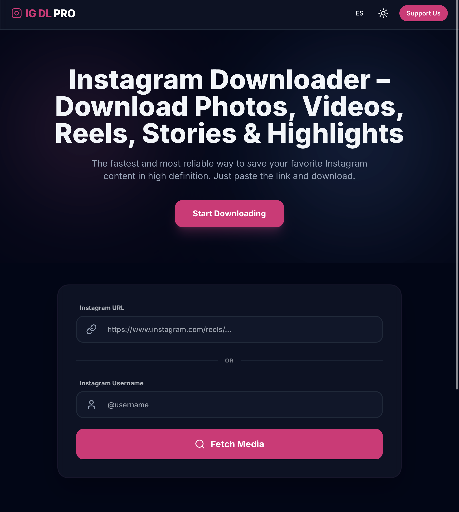

# IGPRO – Instagram Media Downloader

## Preview

---

## 🌐 Demo / Demo
👉 https://igpro.vercel.app

---

## 📌 Descripción / Description

IGPRO is a lightweight web prototype designed to demonstrate how a web application could allow users to download publicly available Instagram media such as photos, videos, reels, stories, and highlights from a profile URL or username.

⚠️ This project is a **frontend prototype for educational and portfolio purposes**.

The application currently demonstrates the **user interface and workflow**, and includes placeholder logic showing where an external API could be integrated.

---

# Project Overview

IGPRO simulates a simple workflow where a user can:

1. Enter an Instagram username or profile URL
2. Process the request
3. Retrieve downloadable media content

While the current version does not yet connect to an external API, the project architecture is prepared for easy integration with services that provide Instagram public media data.

This project was created as a **portfolio demonstration of frontend development and API-ready architecture.**

---

# Current Features

* Clean and minimal user interface
* Input field for Instagram username or profile URL
* Simulated workflow for media retrieval
* Prepared structure for API integration
* Fast static deployment
* Fully responsive layout

---

# Planned Functionality

Once connected to a backend API, IGPRO could allow users to download:

* Instagram profile photos
* Posts (images and videos)
* Reels
* Stories
* Highlights

All media would be retrieved from **public Instagram profiles only**.

---

# Tech Stack

Frontend

* HTML5
* CSS3
* TailwindCSS
* JavaScript

Deployment

* Vercel (serverless hosting)
* GitHub repository

---

# Architecture Concept

User Input
↓
API Request (future integration)
↓
JSON Data Processing
↓
Media Download Interface

The project is designed to demonstrate how a frontend application could interact with third-party APIs to retrieve and display structured social media data.

---

# Live Demo

Try the prototype:

https://igpro.vercel.app/

---

# Disclaimer

This project is intended for **educational and portfolio purposes only**.

It does not currently interact with Instagram's servers or scrape data directly.
Any future implementation would rely on third-party APIs that provide access to publicly available information.

---

# Possible Future Improvements

* API integration for real media retrieval
* Download manager
* Batch downloads
* Media preview gallery
* Engagement statistics
* Mobile-first UI improvements

---

# Author

Flor Peña

GitHub
https://github.com/flormpecasique

---

# License

MIT License
